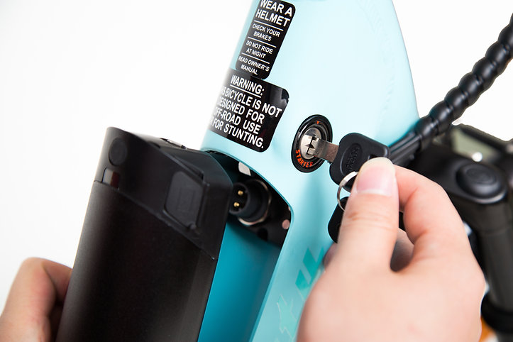

Let's start with the battery as it is probably the most expensive part that like all batteries goes end-of-life as it has a known limitied number of recharge cycles. After a limited number of recharge ccycles the battery will not hold enough charge to power the eMTB motor effectively.

*Battery Details*

Reention EEL MINI 36v 10ah battery - this is the battery that is originally supplied with the Estate eMTB  

Note: There is a physically larger battery called the Reention EEL PRO and this form factor is too large and does not fit the Estate eMTB.  There is also a larger capacity battery than originally supplied with Estate eMTB that fits and it is still 36V but is 14ah up from 10ah  

  
  

Picked up a 2nd battery the other day for $329 which I thought was a decent price. Here is the link.
https://www.kogan.com/au/buy/fortis-275-36v-10ah-hybrid-pro-commuter-electric-mountain-bike-battery-fortis/

In case it helps others I can confirm it charges fine with my existing charger and fits the bike frame well.

The other site that has batteries is https://velectrix.com.au/product-category/accessories-parts/electrical-bike-parts/battery-battery-chargers/

Reention Mini Eel 418 Watt Hour, 36 Volt Battery (single pin charger port)
$649.00

Finally, it's the single pin charger port that is originally supplied with the Estate eMTB that is required for it to work with the original supplied charger(the other option for batteries is a 3 pin charger port plug that does not work with the supplied charger).

*Drivetrain Components:*

Shimano CS-HG200-8 / 8-speed rear Cassette Sprocket = CS  
Shimano Acera rear derailleur  
Shimano SL-M315 / Altus Rapidfire Plus 8-speed Shift Lever - right = SL

  

### Tongsheng TSDZ2 VLCD6 Display
[tongsheng-tsdz2-vlcd6-display-manual](https://www.ebikechoices.com/tongsheng-tsdz2-vlcd6-display-manual/)
[buy on aliexpress](https://www.aliexpress.com/item/1005004731672481.html?spm=a2g0o.detail.1000014.1.10053284pYS6cH&gps-id=pcDetailBottomMoreOtherSeller&scm=1007.40000.326746.0&scm_id=1007.40000.326746.0&scm-url=1007.40000.326746.0&pvid=cf4f0f4e-c460-4195-a8dc-fd1501f9afe8&_t=gps-id:pcDetailBottomMoreOtherSeller,scm-url:1007.40000.326746.0,pvid:cf4f0f4e-c460-4195-a8dc-fd1501f9afe8,tpp_buckets:668%232846%238108%23101&pdp_ext_f=%7B%22sku_id%22%3A%2212000030268141730%22%2C%22sceneId%22%3A%2230050%22%7D&pdp_npi=3%40dis%21AUD%2121.8%2118.53%21%21%21%21%21%40210312cc16776677271422174ec663%2112000030268141730%21rec%21AU%21717717754)

