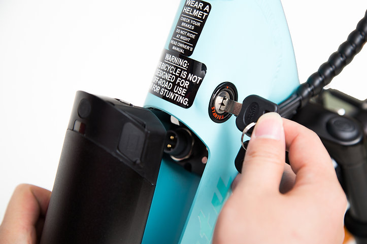

from facebook
"Hey, I know this post is a couple of years old, and there’s almost no info out there on the TSDZ3, but I have the same motor on my estate eMTB, so I wanted to share some details that might help others.
First, inside there’s a plastic nylon helical gear, and it will wear out eventually it’s just a matter of time. The TSDZ2 uses a similar design, but the bearing inside the gear is different, so the TSDZ2 gear won’t work directly on the TSDZ3.
I made a CAD model on Thingiverse so you can CNC a brass replacement gear. You reuse the original bearing from the stock plastic gear and press it into the brass one. It improves durability a lot and should handle torque better as well.
If you want a bit more speed, there’s a modding tool on AliExpress the same one used for the TSDZ2. There’s not a huge amount you can do with power, but you can squeeze a little more performance out of it. Also Going from 36V to 48V is possible, but it gets expensive fast since you’ll need to swap a lot of components.
As for the controller, it’s basically the same as the TSDZ2 controller. The board itself is nearly identical, the main differences are the casing, mounting, and the position of some components/sensors. Because of that, you can sometimes repair the original controller by swapping over damaged components, or even transplant a TSDZ2 controller into the original TSDZ3 housing with some modification. Just keep in mind some components are laid out differently, so it’s not always plug-and-play.
Hope this helps anyone looking for info on these motors."

The mid-drive motor details are:
-TONGSHENG middle motor TSZ3 DC36v 3200 rpm

The battery is probably the most expensive part that like all batteries goes end-of-life as it has a known limitied number of recharge cycles. After a limited number of recharge cycles the battery will not hold enough charge to power the eMTB motor effectively.

*Battery Details*

Reention EEL MINI 36v 10ah battery - this is the battery that is originally supplied with the Estate eMTB  

Note: There is a physically larger battery called the Reention EEL PRO and this form factor is too large and does not fit the Estate eMTB.  There is also a larger capacity battery than originally supplied with Estate eMTB that fits and it is still 36V but is 14ah up from 10ah  

  
  

Picked up a 2nd battery the other day for $329 which I thought was a decent price. Here is the link.
https://www.kogan.com/au/buy/fortis-275-36v-10ah-hybrid-pro-commuter-electric-mountain-bike-battery-fortis/

In case it helps others I can confirm it charges fine with my existing charger and fits the bike frame well.

The other site that has batteries is https://velectrix.com.au/product-category/accessories-parts/electrical-bike-parts/battery-battery-chargers/

Reention Mini Eel 418 Watt Hour, 36 Volt Battery (single pin charger port)
$649.00

Finally, it's the single pin charger port that is originally supplied with the Estate eMTB that is required for it to work with the original supplied charger(the other option for batteries is a 3 pin charger port plug that does not work with the supplied charger).

*Drivetrain Components:*

Shimano CS-HG200-8 / 8-speed rear Cassette Sprocket = CS  
Shimano Acera rear derailleur  
Shimano SL-M315 / Altus Rapidfire Plus 8-speed Shift Lever - right = SL

  

### Tongsheng TSDZ2 VLCD6 Display
[tongsheng-tsdz2-vlcd6-display-manual](https://www.ebikechoices.com/tongsheng-tsdz2-vlcd6-display-manual/)
[buy on aliexpress](https://www.aliexpress.com/item/1005004731672481.html?spm=a2g0o.detail.1000014.1.10053284pYS6cH&gps-id=pcDetailBottomMoreOtherSeller&scm=1007.40000.326746.0&scm_id=1007.40000.326746.0&scm-url=1007.40000.326746.0&pvid=cf4f0f4e-c460-4195-a8dc-fd1501f9afe8&_t=gps-id:pcDetailBottomMoreOtherSeller,scm-url:1007.40000.326746.0,pvid:cf4f0f4e-c460-4195-a8dc-fd1501f9afe8,tpp_buckets:668%232846%238108%23101&pdp_ext_f=%7B%22sku_id%22%3A%2212000030268141730%22%2C%22sceneId%22%3A%2230050%22%7D&pdp_npi=3%40dis%21AUD%2121.8%2118.53%21%21%21%21%21%40210312cc16776677271422174ec663%2112000030268141730%21rec%21AU%21717717754)

